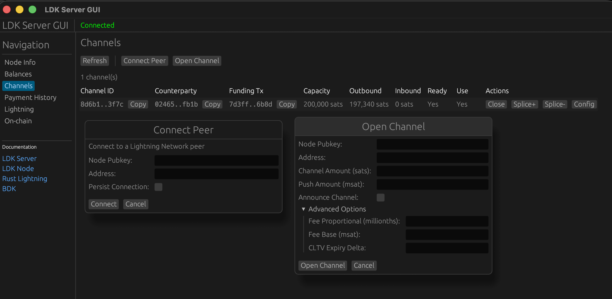
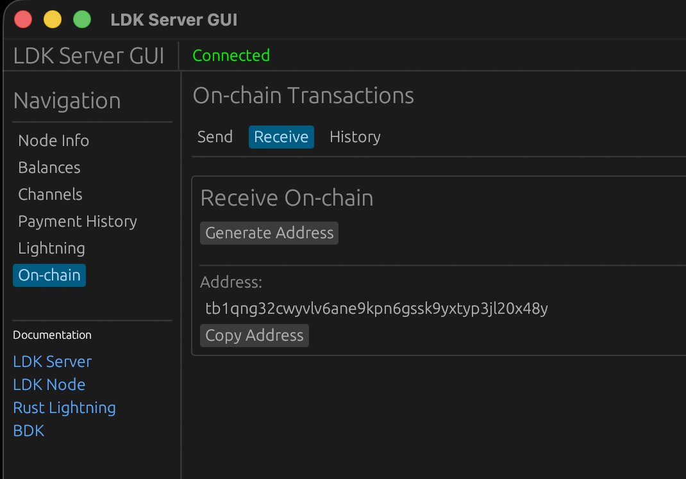
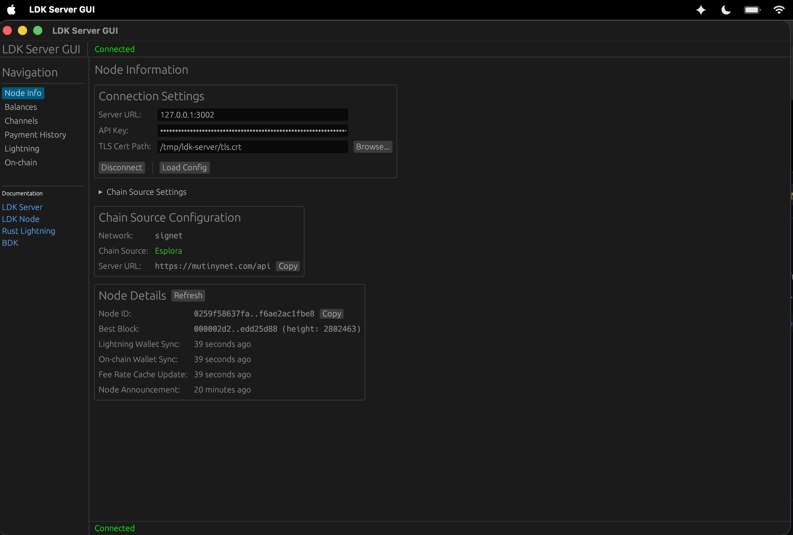
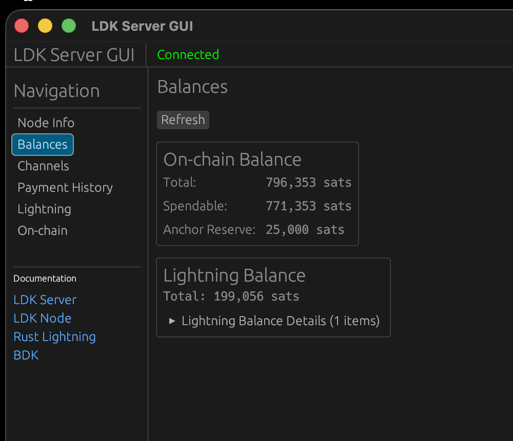
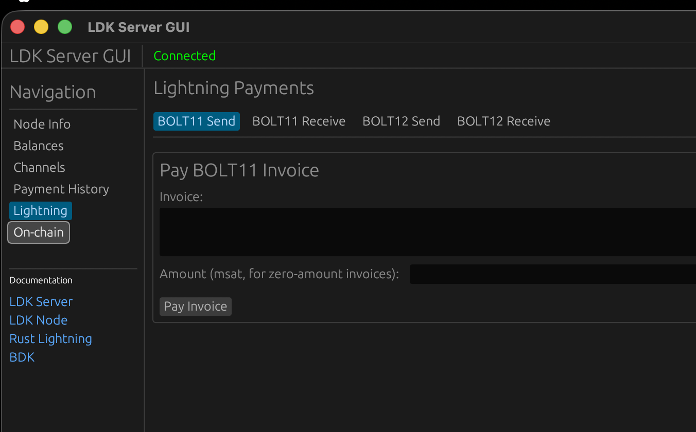
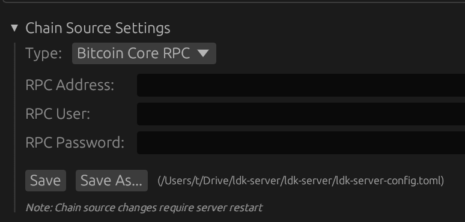

# LDK Server GUI

A graphical user interface for interacting with ldk-server, built with [egui](https://github.com/emilk/egui).

## Screenshots

### Channels


### On-chain


### Node Info (Connected)


### Balances


### Lightning Payments


### RPC Connection


## Prerequisites

**Important:** You must start ldk-server before launching the GUI.

The server generates the TLS certificate on first startup, which is required for the GUI to connect.

```bash
# 1. First, start the ldk-server
cargo run -p ldk-server -- /path/to/ldk-server-config.toml

# 2. Wait for the server to start and generate the TLS certificate
#    You should see output indicating the server is listening

# 3. Then start the GUI (in a separate terminal)
cargo run -p ldk-server-gui
```

## Building

```bash
cargo build -p ldk-server-gui --release
```

## Running

```bash
cargo run -p ldk-server-gui
```

Or run the release binary directly:

```bash
./target/release/ldk-server-gui
```

## Configuration

The GUI automatically searches for `ldk-server-config.toml` in these locations:
- Current directory
- `../ldk-server/` directory
- Parent directory
- Path specified in `LDK_SERVER_CONFIG` environment variable

When found, the connection settings are auto-populated from the config file, including the auto-generated API key.

You can also click **Load Config** to browse for a config file.

### Manual Configuration

If no config file is loaded, configure the connection manually:

| Field | Description | Example |
|-------|-------------|---------|
| Server URL | The ldk-server REST API address (without `https://`) | `localhost:3002` |
| API Key | Hex-encoded API key (see below) | `4181fc9f...` |
| TLS Cert Path | Path to the server's TLS certificate | `/tmp/ldk-server/tls.crt` |

**Note on API Key:** The server auto-generates a random API key on first startup and stores it at `<storage_dir>/<network>/api_key`. To get the hex-encoded key manually:
```bash
xxd -p /tmp/ldk-server/regtest/api_key | tr -d '\n'
```

The TLS certificate is also auto-generated and located at `<storage_dir>/tls.crt`.

Click **Connect** to establish a connection.

## Features

- **Node Info** - View node ID, block height, sync timestamps, and chain source info
- **Balances** - View on-chain and lightning balances
- **Channels** - List, open, close, force-close, splice, and update channel config
- **Payments** - View payment history with pagination
- **Lightning** - Send and receive via BOLT11 invoices and BOLT12 offers
- **On-chain** - Send and receive on-chain transactions

## Running in Browser (WASM)

The GUI can also run in a web browser using WebAssembly.

### Prerequisites

Install [Trunk](https://trunkrs.dev/), a WASM web application bundler:

```bash
cargo install trunk
```

### Building and Running

From the `ldk-server-gui` directory:

```bash
cd ldk-server-gui

# Development server with hot reload
trunk serve

# Or build for production
trunk build --release
```

The development server runs at `http://127.0.0.1:8080` by default.

### Browser Limitations

When running in the browser:
- **TLS certificates** are handled by the browser, so the TLS Cert Path field is not needed
- **File dialogs** are not available; click **Load Config** to paste your `ldk-server-config.toml` contents instead
- **API Key** must be entered manually (the config file doesn't contain it). Get it with:
  ```bash
  xxd -p /tmp/ldk-server/regtest/api_key | tr -d '\n'
  ```

### CORS Configuration

Your ldk-server must allow CORS requests from the browser origin. If you encounter CORS errors, ensure your server is configured to accept requests from `http://127.0.0.1:8080` (or wherever Trunk is serving).

## Umbrel App

The GUI can be deployed as an Umbrel app using the files in `umbrel/`.

### Testing Locally with Docker

1. Build the WASM GUI:
   ```bash
   cd ldk-server-gui
   trunk build --release
   ```

2. Run with Docker Compose:
   ```bash
   cd ../umbrel
   export APP_DATA_DIR="$(pwd)/data"
   export APP_LDK_SERVER_IP=172.20.0.2
   export APP_LDK_WEB_IP=172.20.0.3

   docker compose up --build
   ```

3. Open `http://localhost:8080` in your browser.

### Deploying to Umbrel

**Option 1: Custom App Store**
1. Push the repo to GitHub
2. On Umbrel: Settings → App Store → Add your repo URL

**Option 2: Direct Install**
```bash
ssh umbrel@umbrel.local
cd ~/umbrel/app-data
git clone <your-repo> ldk-server
~/umbrel/scripts/app install ldk-server
```

**Option 3: Community App Store**
1. Fork `github.com/getumbrel/umbrel-apps`
2. Add the `umbrel/` folder as `ldk-server/`
3. Submit a PR

### Architecture

The Umbrel deployment uses nginx as a reverse proxy:

```
Browser → nginx:8080 → /api/* → ldk-server:3002 (internal)
                     → /*     → WASM GUI (static files)
```

This eliminates CORS issues since everything is served from the same origin.
